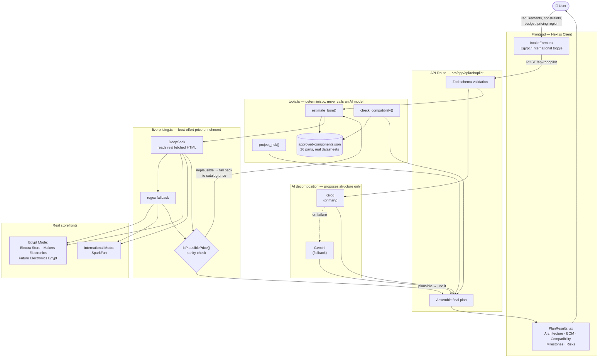

# RoboPilot — Robotics & Embedded Project Engineering Copilot

**Team 05 · AI in Applications program** (supervised by Dr. Ahmed Métwalli)

A robotics project engineering copilot that converts requirements into
architecture, components, BOM estimates, risks, milestones, and grounded
component guidance — for robotics clubs, embedded-systems teams, and
capstone groups.

## Team

| Module | Owner |
|---|---|
| AI & Backend (API, schemas, providers, deterministic tools) | Adam Tayel |
| Integration / Architecture / Deployment | Adam Tayel |
| Product UI & Workflow | Youssef Mashhour |
| Knowledge, Tools & Quality | Mina Rimon |

*(Team composition changed after the initial assignment — Adam covered all
four roles for the working system described below. See `AI_USAGE.md` for
how AI assistance was used and verified across each module. See
"What each teammate should be able to explain" below for how the team is
catching up on the parts they didn't build, ahead of individual defense.)*

## System architecture



**The one rule that shapes everything above:** the AI layer (Groq/Gemini/
DeepSeek) only ever *proposes* or *reads real fetched content* — it never
computes a price, a compatibility result, or a risk score directly. Those
three are 100% deterministic code in `tools.ts`, and any live-scraped price
is sanity-checked against the known catalog reference before it's trusted.
See `docs/evaluation.md` Case 4 for a real incident this caught.

## Problem

Student robotics teams often begin with exciting ideas but lack structured
requirements, component decisions, risk tracking, and an achievable build
plan.

## Main workflow

Team enters robotics requirements and constraints → system decomposes
requirements → proposes architecture → retrieves approved component
information (from a verified catalog **and** live current prices) → checks
compatibility/BOM → produces milestones and project risks.

## Tech stack

- **Next.js** (App Router, Route Handlers) — server boundary
- **TypeScript + Zod** — end-to-end typed validation
- **Groq** (primary) → **Gemini** (fallback) — structured-output AI
  providers for requirement decomposition
- **DeepSeek** (`deepseek-v4-flash`) — reads real, live-fetched store pages
  to extract current prices; regex fallback if unavailable — see
  `AI_USAGE.md`
- **Vitest** — 62 unit + API tests
- **Vercel** — deployment target

## Product UI

`src/app/page.tsx` is a client-rendered page with two panels: the intake
form on the left (`IntakeForm.tsx`, with an Egypt/International pricing
region toggle and an animated robot-face logo) and the result panel on the
right, which switches between four explicit states — idle
(`EmptyState.tsx`), loading (`LoadingState.tsx`, robot logo in its
"thinking" animation), error (`ErrorState.tsx`, with a retry button that
resubmits the last request), and success (`PlanResults.tsx`, which
composes `ArchitectureFlow`, `BomTable`, `CompatibilityList`,
`MilestoneTimeline`, `RiskList`, `TestPlanList` and `AssumptionsList`, with
a fade/slide reveal animation).

Verified end-to-end: `npm run build` compiles both the page and the API
route; the deployed app was smoke-tested repeatedly across ~15 real plan
generations spanning 5 different project types (line-following rover,
GPS data logger, robotic gripper arm, plant-watering system, security bot,
color-sorting arm, weather station), in both pricing regions.

## Getting started

```bash
git clone <repo-url>
cd robopilot
npm install
cp .env.example .env.local   # fill in GROQ_API_KEY / GEMINI_API_KEY / DEEPSEEK_API_KEY, or set ROBOPILOT_STUB_MODE=true
npm run typecheck
npm test
npm run dev
```

## Documentation map

| Doc | What's in it |
|---|---|
| `docs/architecture.md` | System diagram, module boundaries, deployment plan, known limitations |
| `docs/ai-backend-module.md` | Deep dive on the AI/Backend module specifically |
| `docs/api-contract.md` | Exact request/response shapes for `POST /api/robopilot` |
| `docs/release-checklist.md` | Pre-deployment checklist, owned by the Integration Lead |
| `docs/evaluation.md` | 10-case evaluation matrix — 9 of 10 are real incidents from development, not synthetic scenarios |
| `docs/source-register.md` | Real datasheet/source for every one of the 26 approved catalog components |
| `AI_USAGE.md` | AI tools used (Groq, Gemini, DeepSeek), what was delegated, cost, and how each was verified |
| `DEMO_SCRIPT.md` | 3-minute defense demo script |

## Mandatory production features (from the project brief)

- [x] Project intake / requirement decomposition
- [x] Architecture plan (AI-proposed, schema-validated)
- [x] Component knowledge base (approved catalog, **26 parts**, each with a real datasheet source)
- [x] BOM estimator (`estimate_bom`) — catalog-backed, plus live pricing from real stores (Egypt + international)
- [x] Compatibility checker (`check_compatibility`)
- [x] Risk register (`project_risk`)
- [x] Milestone plan
- [x] Project wizard UI (`src/app/page.tsx` + `src/components/robopilot/`)
- [x] Troubleshooting knowledge assistant / expanded catalog
- [x] Public deployment

## What each teammate should be able to explain

Since the code was built by one person this cycle, here's what each named
owner should walk through their own section on before the individual
defense — not to memorize a script, but to genuinely understand it:

**Youssef Mashhour — Product UI & Workflow**
- Read `IntakeForm.tsx` end to end: how form state maps to the API request
  body, and how `switchRegion()` converts the budget number (not just its
  label) when the pricing mode changes.
- Be able to explain the four view states in `page.tsx` (`idle`/`loading`/
  `error`/`success`) and why `LoadingState`/`EmptyState` use the same
  `RobotLogo` component in two different animation states instead of two
  separate assets.
- Know why there's no `localStorage`/browser-storage usage anywhere in the
  UI (not needed here, and would fail differently in different
  environments).

**Mina Rimon — Knowledge, Tools & Quality**
- Read `tools.ts` end to end: why `estimate_bom`, `check_compatibility`,
  and `project_risk` never call an AI model, and what `isPlausiblePrice()`
  protects against (see `docs/evaluation.md` Case 4 for the real incident
  that justified it).
- Be able to explain `docs/source-register.md`: where each catalog entry's
  price/voltage/interface actually came from, and which entries are
  flagged ⚠️ (best-effort, not independently re-verified this session) vs
  ✅ (source confirmed).
- Walk through 2–3 cases in `docs/evaluation.md` in detail, including at
  least one that was a real bug (not just a pass).

**Adam Tayel — AI & Backend, Integration, Deployment**
- Already covers the full stack; primary contact for the DeepSeek
  live-pricing pipeline (`live-pricing.ts`, `deepseek-extractor.ts`) and
  the Groq→Gemini fallback logic (`providers.ts`).

## Out of scope (by design)

Safety-critical design approval, automatic purchasing, components outside
the approved catalog without explicit sign-off, or claiming physical
testing that was not performed.

## Known limitations

See `docs/architecture.md` §6 and `docs/evaluation.md`'s closing note.
Most notably:
- This is currently a single-owner build rather than a four-person team;
  the "What each teammate should be able to explain" section above is how
  the integration-review requirement is being satisfied for now.
- The catalog focuses on ground robotics; drone-specific parts (barometric
  sensors, coreless propulsion motors) are a known, disclosed gap rather
  than guessed.
- Electra Store's live search URL, and a handful of ⚠️-flagged datasheet
  links in `docs/source-register.md`, were added under time pressure and
  are best-effort rather than independently re-verified this session.

## License / academic context

Built as part of the "AI in Applications" training program. Not for
production/commercial use without further hardening (see limitations
above).
